```{r}
#| label: setup
#| include: false

library(tidyverse)
library(fs)
library(arrow)
library(duckdb)
library(dbplyr)
library(sf)
library(tmap)
library(tinytable)
library(modelsummary)

# notebook results
output_path <- fs::dir_create("./output")
load(file = fs::path(output_path, "01_data.Rdata"))
load(file = fs::path(output_path, "02_episodes.Rdata"))
load(file = fs::path(output_path, "03_st_paths.Rdata"))
load(file = fs::path(output_path, "05_stv_calculator.Rdata"))
load(file = fs::path(output_path, "06_pasta_calculator.Rdata"))
#load(file = fs::path(output_path, "07_person_based.Rdata"))
load(file = fs::path(output_path, "07_place_access.Rdata"))
load(file = fs::path(output_path, "08_comparisons.Rdata"))
load(file = fs::path(output_path, "09_samples.Rdata"))
```

# Introduction

At its core, the concept of transportation accessibility reflects the intensity of the potential for interaction with opportunities [@hansen1959], the extent to which land-use and transport systems enable individuals or groups to reach activities or destinations [@geurs2004], or the ease with which individuals can interact with destination opportunities using the transportation network [@paez2012]. More specifically, accessibility considers two components: the spatial distribution of opportunities (i.e., land uses) and the cost of movement, which depends on the transportation system and how people use it.

In practice, researchers have developed and employed a variety of different measures of accessibility that operationalize the components of access in different ways. A useful framework to think about different accessibility measures is provided by @wu2020, who show how gravity, cumulative opportunities, utility-based accessibility, and numerous other representations, are special cases of the following general formula:

$$
S_{i} \propto  \sum_j g(O_j) f(t_{ij})
$$ {#eq-unifying_accessibility}

\noindent where:

-   $S_{i}$ is accessibility from the perspective of geographical location $i$
-   $g(O_j)$ is a function of the opportunities at geographical location $j$
-   $f(c_{ij})$ is an impedance function that depends on the cost of movement between $i$ and $j$

Place-based measures, including gravity- and cumulative-type measures (see @eq-gravity_based) are arguably the most dominant in the literature and are rooted in spatial interaction models [@hansen1959; @wilson1971]. They are simple, since they are just weighted sums of opportunities, and can be easily implemented in practice. With this category of measures it is possible to capture the ease with which a traveller can potentially reach spatially-distributed destination opportunities from a given origin using the transportation network. With the calculations completed over many origin zones, the results reflect more aggregate geographic patterns of access across a city or region. However, these measures often fail to account for various individual mobility profiles (e.g., daily schedules, space-time constraints, and special travel behaviors), leading to inaccurate and unrealistic estimates of the potential for interaction [@miller2007; @paez2010].

$$
S_{i} =  \sum_j O_j f(t_{ij})
$$ {#eq-gravity_based}

Moreover, since the results are aggregate, it is possible to ignore an otherwise puzzling temporal paradox: other things being equal, the longer any one given individual travels, the greater their accessibility--but the less time they have to spend engaging in activities. In other words, place-based accessibility pays too much attention to the _reachability_ of opportunities, but neglects the available time (and more personal factors such as willingness) for _interacting_ with the opportunities. Potential activity time is essential for quality of life in modern society. For example, despite the increase of mobility in recent years--suggesting increasing accessibility--the issue of time poverty is getting more severe [@giurge2020]. This has led to a greater focus on time-centered urban policies recently, such chrono-urbanism and its 15-minute City planning model, which highlights proximity-based accessibility to save travel time for daily activities [@silva2025].

In contrast, person-based measures (again, see @wu2020) combine individual space-time behaviors with the transportation and land use components of accessibility, thus bringing the temporal dimension into accessibility measurement. The foundation of these measures is in time geography [@hagerstrand1970] via the concept of the space-time prism (STP) and its projection on the geographical plane, the Potential Path Area (PPA). Such measures are theoretically sound and calculate access based on individual space-time opportunities and constraints [@miller1991]. An important aspect of this approach is the ability to compute temporal measures associated with accessibility, namely: how much time does someone have available for interaction at a destination given their space-time constraints? From this, a common person-based measure of cumulative accessibility is defined as:

$$
S_{p} =  \sum_{j \in PPA_{p}} O_j
$$ {#eq-ppa_based}

\noindent where:

-   $S_{p}$ is the accessibility of person $p$
-   $PPA_p$ is the Potential Path Area of person $p$

In other words, one measure of person-based accessibility is the sum of opportunities, or the feasible opportunities set [@kwan1998], that lie inside the PPA of an individual $p$. Nevertheless, it is difficult to link such person-based measures back to geographical places, such as individual home locations, limiting the contribution of person-based accessibility to planning practice [@siddiq2021]. Thus, while person-based measures can generate more exact accessibility attributes for individuals, practitioners often still rely on place-based measures to generate straightforward accessibility indicators for places. Moreover, another factor constraining the application of person-based accessibility is the high data and computing requirements and it is only recently that advances in these areas have enabled researchers to better capitalize on the analytical power of the STP concept at a large scale [e.g. @chen2018; @liu2022; @saraiva2022].

This study makes both a methodological and applied contribution by integrating the space-time foundations of person-based accessibility into the place-based measurement of accessible opportunities. We propose Person-based Aggregate Space-Time Accessibility (PASTA) as a new measure of access. Inspired by the work of Hägerstrand and colleagues into the supply of population time and activity participation [@ellegard2018, pp. 59-62] and @hansen1959's [pp. 73] definition of accessibility as the "intensity of the possibility of interaction", PASTA bridges the gaps between the strengths of place- and person-based measures of access: it leverages the solid theoretical grounding of person-based measures in time geography to capture the intensity of the potential to interact with opportunities given individual-level space-time constraints and aggregates these outcomes to evaluate the population-level accessibility of places within the study region.

On the methodological side, PASTA is underpinned by the development of several novel and flexible computational workflows. These include constructing large-scale individual and multimodal STPs using commonly available datasets such as travel surveys, open street networks, and transit feeds; transforming travel survey records into pseudo activity-based datasets; generating space–time paths from observed travel episodes; and routing trips across multimodal networks within both the forward and reverse cones of each prism. STPs are stored within a voxel-based data structure that represents prisms as multidimensional arrays consisting of volumes of space and time. This discretized model supports efficient storage and computation, while the incorporation of weights enables aggregation from sampled individuals to population-level accessibility estimates. The voxel framework further allows aggregation along multiple analytical dimensions, including space, time, travel behaviour, and socioeconomic characteristics.

The result of these aggregations is PASTA--a measure of the potential to interact with opportunities that simultaneously reflects the land use and transportation systems and the constraints embedded within individual space–time prisms. In doing so, PASTA extends the space–time accessibility literature, which has largely remained person-based [e.g., @neutens2010b], by expressing these dynamics as a place-based metric. Unlike conventional place-based measures reported in impedance-weighted opportunity units, PASTA quantifies interaction potential in units of time derived from daily activity schedules, enabling a more behaviourally grounded assessment of access that supports space–time integrated planning. All code and results are released in computational notebooks, and the framework relies on publicly accessible mobility data, facilitating open and reproducible research [@paez2021].

The rest of this article is organized as follows. The next section reviews gravity-based measures of accessibility and proposes their integration with person-based measures to generate the new measure of PASTA. The linkage between PASTA and a time-geographic idea of urban temporal planning is further presented, illustrated by a conceptual framework. The method to measure PASTA is proposed in the third section, followed by a case example to implement this method in the forth section. In the case example, drawing upon 2018 New York Travel Survey, we measured the PASTA for the entire New York City population across different time periods, different travel modes, and different social groups. The function of PASTA in the analysis of sociospatial equity and in generating planning implications are also illustrated and discussed in the final section of this article.

# Background

## Place-based Accessibility

To calculate place-based accessibility, researchers often utilize cumulative opportunities or gravity-based measures. The main difference between these approaches is the way in which travel impedance is specified, with cumulative opportunities measures based on a simplified version of the gravity-based approach. In this regard, gravity-based measures of access have their foundations in gravity-based models of spatial interaction potential which, adapted from @wilson1971 for commuting flows, take the general unconstrained form:

$$
T_{ij} = k \times P_i \times O_j \times f(t_{ij})
$$ {#eq-wilson_gravity}

\noindent where the total trip flows $T$ between origin zone $i$ and destination zone $j$ are a function of the interaction between the masses of population $P$ and opportunities $O$ at the origin and destination zones discounted by some function $f$ of the travel cost, such as travel time $t_{ij}$ between the origin and destination pair. The $k$ term acts as a scaling parameter. From this, gravity-based accessibility (@eq-gravity_based) is calculated by summing @eq-wilson_gravity over $j$ for each $i$. Alternatively, a measure of market potential, such as the number of people that can potentially interact with a destination, is obtained by summing over $i$ [@soukhov2025].

The impedance function can take any form, ranging from normative expectations about travel, such as the cumulative or binary functions based around travel time thresholds to functions calibrated to observed trip flows or trip length distributions [@paez2012]. The popularity of gravity-based measures stems from pragmatic considerations [@miller2018], with the measures generally being consistent with the main transportation and land use components of accessibility [@geurs2004], easy to compute, particularly with advances in data availability and computing power [@higgins2022], and their plausible relationship with a variety of social phenomena such as travel behaviour, health outcomes, and property values [@wu2020].

However, gravity-based measures of accessibility have been criticized in a number of ways. This includes discussions around tradeoffs between the interpretability of simpler cumulative opportunities measures and the complexity of gravity-based measures that better incorporate the concept of distance decay [@geurs2004; @kapatsila2023]. But at a higher level, the place-based perspective has been criticized for being ad-hoc [@handy1997] and lacking strong foundations in theory [@geurs2004; @miller2018], providing an incomplete understanding of the relationships between people and activities [@miller2007] and time [@kwan2013].

Moreover, with their foundations in aggregate notions of mass and flow, place-based measures can struggle to incorporate or disentangle more individual-level considerations around space-time constraints, leading to paradoxical issues associated with the relationship between observed travel behaviour, impedance, accessibility, and inequality. For example, low-income households may travel longer to reach opportunities. By extension, an impedance function calibrated to these greater trip length distributions may be more generous with respect to weighting more distant opportunities. This can then result in high levels of place-based accessibility for this group relative to others, leading @giannotti2022 to caution against interpreting higher observed travel times and patterns as higher willingness to travel. Therefore, if we are to better understand the accessibility of different individuals or groups, there is a need for better integrating individual-level space-time constraints into these place-based measures.

## Integrating Person-based Accessibility into Place-based Measures

Person-based accessibility measures accessibility for individuals given their space-time constraints. Person-based accessibility is typically measured via the calculation of STPs that reflect the potential space and time to interact with opportunities between two space-time anchors given specific travel modes and individual travel budgets considering capability, authority, and coupling constraints [@hagerstrand1970]. A hypothetical STP is shown in @fig-spacetimeprism, the key elements of which can be defined as:

-   $i$ is the spatial location of the origin anchor

-   $j$ is the spatial location of intermediate opportunities

-   $k$ is the spatial location of the destination anchor

-   $t_{i}$ is the departure time from anchor $i$

-   $t_{k}$ is the arrival time at anchor $k$

-   $a_{min}$ is the minimum time allotted for engaging in activities at any location and this minimum activity time defines the height of the cylinder

-   $b_{ik}$ is the time budget for activities, defined as $b_{ik} = t_{k} - t_{i} - a_{min}$

-   the forward cone is defined by the travel times $t_{ij}^m$ from origin anchor $i$ to intervening locations $j$ using a transport mode $m$, while the reverse cone is defined by to the travel times $t_{jk}^m$ from the intervening locations $j$ to the destination anchor $k$.

-   For convenience, the prism in @fig-spacetimeprism is based on Euclidean distances and constant travel speeds; in practice network travel times and different modal options would create an irregularly-shaped prism.

-   The Potential Path Area: The projection of the Space Time Prism into two-dimensional geographical space represents how far an individual can travel within their space-time constraints.

```{r}
#| label: fig-spacetimeprism 
#| fig-cap: "A general space time prism in planar space" 
#| echo: false 
#| out-width: 80% 
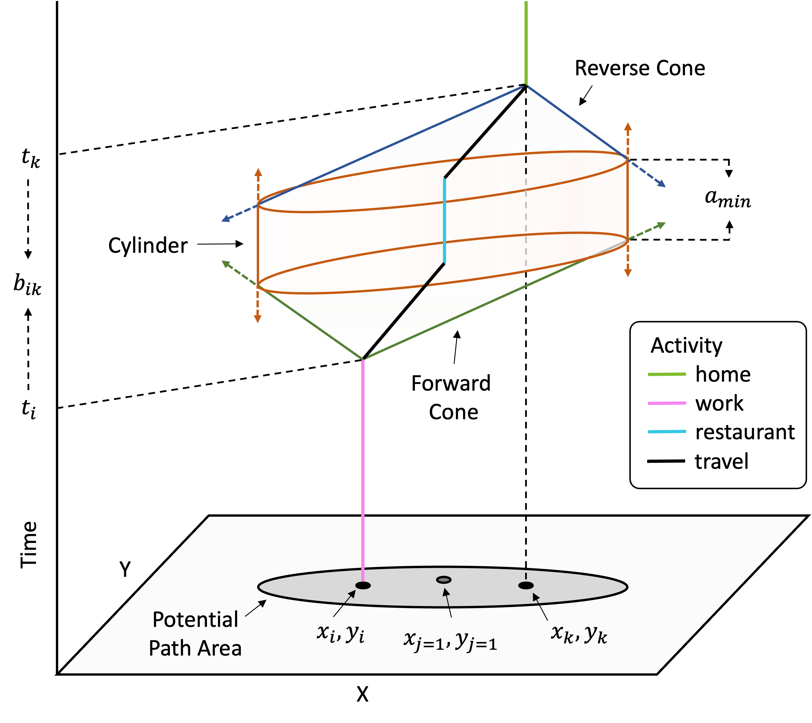
```

The STP captures both spatial and temporal dimensions of accessibility based on daily activity schedules. If we assume that fixed activities occur at space-time anchors, such as home and workplace locations, flexible activities, such as shopping or recreation, are those that can occur within the spatial and temporal gaps between these fixed activities - more specifically, within the bounds of the STP defined by the intersection of the forward cone, cylinder, and reverse cone.

In the hypothetical case, the individual's observed space-time path indicates they travelled from their origin anchor $i$ (workplace) at time $t_i$, engaged in an activity (restaurant) at an intervening location for the minimum duration $a_{min}$, then travelled to the destination $k$ (home), arriving at time $t_k$. If we assume the activity engaged in at the intermediate location was flexible in that they are easy to relocate and reschedule, the time budget can be used to travel from $i$ to any intervening opportunities $j = 1...J$, so long as $t_{ij} + a_{min} + t_{jk} <= t_{ik}$: that there is enough time is available to travel from the origin anchor to the activity, engage in the activity, and make it to the destination anchor in time for $t_k$.

From this foundation, a variety of different person-based measures of accessibility can be derived, including the area of an individual's PPA or volume of their STP [@burns1980] to cumulative opportunities-style measures that capture the number of destinations or feasible opportunities within a PPA or STP such as in [@eq-ppa_based; e.g. @miller1991; @miller2004; @kwan1998; @kwan1999], gravity-style measures that calculate locational benefits using decay functions [@neutens2010], and utility-style measures that capture the potential utility associated with accessible destinations [@neutens2010a; @neutens2010b]. More recent progress can be broadly summarized into the following topic areas: considering individual heterogeneities such as travel strategies and mobility abilities and perceptions [@kar2023; @lee2020; @lee2023; @widener2015]; examining transportation equity through the lens of individual or population-subgroups and person-based accessibility measures [@fransen2019; @saraiva2022]; accounting for multimodal travel networks and realistic travel schedules [@cheng2018; @qin2021; @liu2022]; integrating activity programs to model complex activity chains [@liao2019; @lyu2024]; estimating the probability of space-time paths within STP [@winter2010; @song2015; @downs2013]; and developing computation tools and packages [@charleux2014; @delafontaine2012; @loraamm2020; @neutens2010].

While these improvements make the calculation of person-based accessibility more convenient and more realistic, existing studies generally consider person-based and place-based accessibility as distinct measures. This is reasonable because they measure accessibility at different levels; however, the distinction limits the potential to integrate the consideration of space-time constraints from person-based accessibility into place-based measures. In contrast, PASTA integrates the person- and place-based approaches by aggregating individual STPs over space. The aggregation is not simply based on whether opportunities are within STPs, but based on the possibility and intensity to interact with intermediate places. In other words, the potential interaction (e.g., available time at the place) is aggregated, resulting in the geographical distribution of potential interaction. In this case, the temporal paradox of place-based measures may be solved: a place with high level of access not only shows that it can be reached by more travelers (i.e., spatial interaction), but also illustrates that it can accommodate these potential interactions given individual space-time constraints.

Moreover, PASTA can better link with space-time integrated planning compared to the conventional person-based measurement of space-time accessibility. As shown in @fig-staconceptual, traditional person-based space-time accessibility is based on the analysis of individual spatial movements. These movements are shaped by individual attributes and daily schedules as well as urban-level land use and transportation. Some measures further account for the service hours of urban facilities [e.g., @neutens2010b]. Practically, these measures can illustrate sociospatial equity issues better than conventional place-based measures [e.g. @saraiva2022]; however, because they do not provide attributes of places (except some averaging methods recently, see @lee2019), planning practitioners find it difficult to use them as indicators to evaluate and manipulate places [@siddiq2021].

In comparison, PASTA can account for the four components in @fig-staconceptual but in a more collective and aggregated way. By aggregating individual STPs, PASTA evaluates how the supplies of existing urban spatial configuration and temporal schedules can fit the demands of population-level activities and travels. This echoes the time-geographic idea of the available supply of population time, matching individuals with necessary, flexible, and delegated activities in both time and space, and the demands on population time from public and private organizations [@ellegard2018, pp. 59-62]. Within this framework, the results of PASTA - measuring the geographic distribution of potential interaction - focus just on the supply side of population time to illustrate where and for how long the population can potentially perform certain activities. Practitioners can further use this to generate appropriate spatial or temporal policies.

```{r}
#| label: fig-staconceptual
#| fig-cap: "A conceptual framework of person- and place-based space-time accessibility" 
#| echo: false 
#| out-width: 80% 
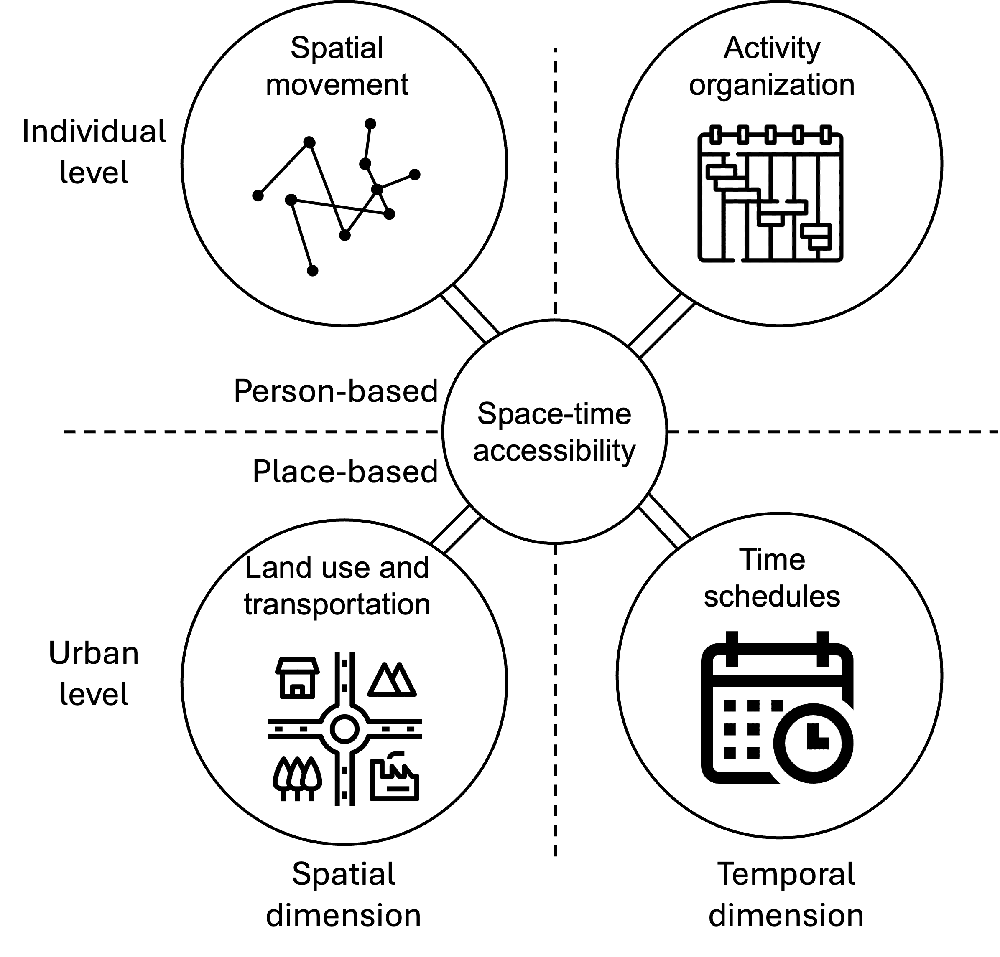
```

```{=html}
<!-- Texts from previous version:

Overall, these improvements make the calculation of person-based accessibility more convenient and more realistic. However, despite the strong theoretical grounding of person-based measures in time geography, the disadvantages of these measures concern their operationalization and communicability [@geurs2004]. The significant data requirements and a lack of available data on activity episodes and the computational intensity of calculating STPs has meant that most studies examine only subsets of the population. Moreover, because STPs and PPAs are calculated at the individual-level, it can be difficult to use person-based measures to capture more spatially aggregate levels, which can limit the applicability of these measures in planning practice [@siddiq2021].

In comparison, gravity-based accessibility measures do not have the aggregation issue because they measure accessibility at spatial levels, but they have their own their disadvantages as discussed above. 

This study aims for bridging gravity- and person-based accessibility by proposing the measurement of PASTA. Person-based accessibility, as discussed before, can respond to the critique of place- and gravity-based accessibility by offering a sound theoretical basis in time-geography and accounting for individual mobility and time constraints. To address the limitation of calculating accessibility at the individual-level, PASTA aggregates person-based accessibility into spatial units and population-level totals with the goal of better reflecting the core of the accessibility concept as the intensity of the potential for interaction [@hansen1959].
-->
```

# Data and Methods

This section begins by introducing the New York City study area. Next, to operationalize the time geographic concept of the STP in this work, three additional methodological steps are explained below, including the creation of activity episodes and space-time paths from travel survey data, the voxel-based data model for calculating multimodal STPs, and the aggregation of STPs into PASTA.

```{=html}
<!-- CL
I am thinking maybe we could start with a more general method of PSATA (e.g., considering visit probability and service hours) and then introduce the data in this section. We could even combine the data and the results into one single section as the case example.
-->
```

## Study Area

The study are for this work is New York City. Home to `r boundaries_boroughs |> st_drop_geometry() |> summarize(sum(estimate)/1000000) |> round(digits = 1)` million people (from the 2022 5-year American Community Survey (ACS)) and featuring dense multimodal transportation networks and clusters of high-density and mixed-use development, the city provides a rich urban context in which to study person-based accessibility. Moreover, a key consideration is the availability of an open travel survey on which the PASTA method can be developed. In this case, we utilize the Metropolitan Transportation Authority's (MTA) 2018 New York City Travel Survey, which recruited `r nycts_person_weights |> nrow() |> prettyNum(big.mark = ",")` respondents and captured `r nycts_2018_linked |> nrow() |> prettyNum(big.mark = ",")` trips.

In general, the survey's responses are weighted to represent the characteristics of travellers and tripmaking at the population-level using person- and trip-based weights. The latter are person-weights with a slight adjustment applied to transit trips so that estimated flows better align with observed counts. While the survey was collected over March-April 2018, the weighting is utilized to capture a summarized snapshot of travel behaviour corresponding to a typical weekday, Saturday, and Sunday in the city. This survey is notable for marking the first time the MTA utilized mobile phone-based tracking for a subset of respondents. While the travel diary information collected from the respondents was the same across both methods, locations for smartphone users were captured using GPS coordinates and respondents engaged with the survey for up to a week compared to the one-day diary for online or phone respondents. Approximately 28% of households and 61% of trips were captured through the smartphone-based method. For geographic locations, this work relies on the use of census block groups as origin and destination zones, as this information is available for all trips (aside from a handful with missing data).

Beyond the travel survey, data from several different sources was collected to facilitate the PASTA calculations. This includes block-group geographic boundaries and associated socioeconomic and demographic characteristics collected from the 2022 ACS using the {tidycensus} package. We also collected GTFS files for the region's rail, bus, and ferry transit providers that align with the survey time period and obtained a street network from OpenStreetMap using the {osmextract} package. To account for elevation in the routing network, an elevation raster was obtained for the study area (approximately 15m resolution) using {elevatr}.

## Trips, Episodes, and Space-time Paths

### Creating Episodes from Trips

A critical input into the calculation of person-based accessibility is an activity diary that can be used to identify the vertices that bound the STP by its start and end times. The extensive and highly detailed information required from respondents means much of the previous research into person-based access has focused on smaller samples. In contrast, household travel surveys are more common and often conducted to reflect tripmaking behaviour at the population level. Still, activity episodes must be inferred from the trip information and these surveys may only capture trips over one or a handful of days.

Furthermore, an important concern is the uncertainty associated with prism vertices and the potential flexibility in start and end times. For example, an activity diary may capture the start and end times of a journey to work, but these observed vertices may not reflect the earliest possible time someone could leave or the degree to which arriving late might be acceptable [see @neutens2011 for a discussion]. In response, some research utilizes model-based approaches to approximate prism vertices while others adopt what @neutens2011 refer to as the pragmatic approach by directly using trip start and end times.

In the present case, we focus on exploring the potential of PASTA and infer activity episodes from the travel survey using the observed destination types and times at the start and end of trips. The general structure of the survey tips can be seen in @tbl-trip_table, which presents a simplified overview of the data for a hypothetical respondent who travelled to and from work using transit then walked to engage in some other activities in the evening.

```{r}
#| label: tbl-trip_table
#| tbl-cap: "Unlinked Trips for a Sample Person"
#| echo: false
#| message: false
#| warning: false

trip_table |> 
  tt() |>  
  format_tt(escape = TRUE) |> 
  style_tt(fontsize = .75) |> 
  theme_tt("spacing")
```

Based on this structure, we can infer the activity episodes based on the trips between origin and destination types @tbl-episode_table. This primarily involves adding stay activities between trips, including initial and last stays. More complex operations included identifying sequential blocks of time for each respondent. This is because some individuals completed the survey over one day or over multiple sequential days (up to a week), while others may complete the survey over two separate sequences of time (e.g. Saturday-Sunday and Tuesday-Thursday). In all cases, initial and last stay episodes were added to complete an individual's sequential time blocks within 24h days.

```{r}
#| label: tbl-episode_table
#| tbl-cap: "Activity Episodes for a Sample Person"
#| echo: false
#| warning: false

episode_table |> 
  tt() |>  
  format_tt(escape = TRUE) |> 
  style_tt(fontsize = .75) |> 
  theme_tt("spacing")
```

@fig-tempograms plots tempograms over the three survey day types, accounting for the person weights in the inferred activity durations. A typical weekday is largely defined by home, work, and education-related stays interspersed with travel. Compared to Saturday and Sunday, less time is spent engaging in other activities such as recreation or shopping.

```{r}
#| label: prepare fig_tempograms
#| echo: false
#| eval: true

fig_tempograms <- episodes_tempogram |>
  ggplot(aes(x = std_time, y = activity_time_w, fill = activity_desc_sum, colour = activity_desc_sum)) +
  geom_area(position = position_fill(), alpha = .8) +
  scale_x_time(breaks = scales::date_breaks("3 hours")) +
  scale_y_continuous(labels = scales::percent) +
  facet_wrap(vars(std_wday), nrow = 3) +
  theme_minimal() +
  theme(
    legend.position = "right",
    axis.title.x = element_blank(),
    axis.title.y = element_blank(),
    legend.title = element_blank()
  )

ggsave(fig_tempograms, filename = "./img/fig_tempograms.jpg", height = 8, width = 8, dpi = 300)
```

```{r}
#| label: fig-tempograms
#| fig-cap: "Tempograms of Activities for Survey Days"
#| echo: false
#| out-width: 100%

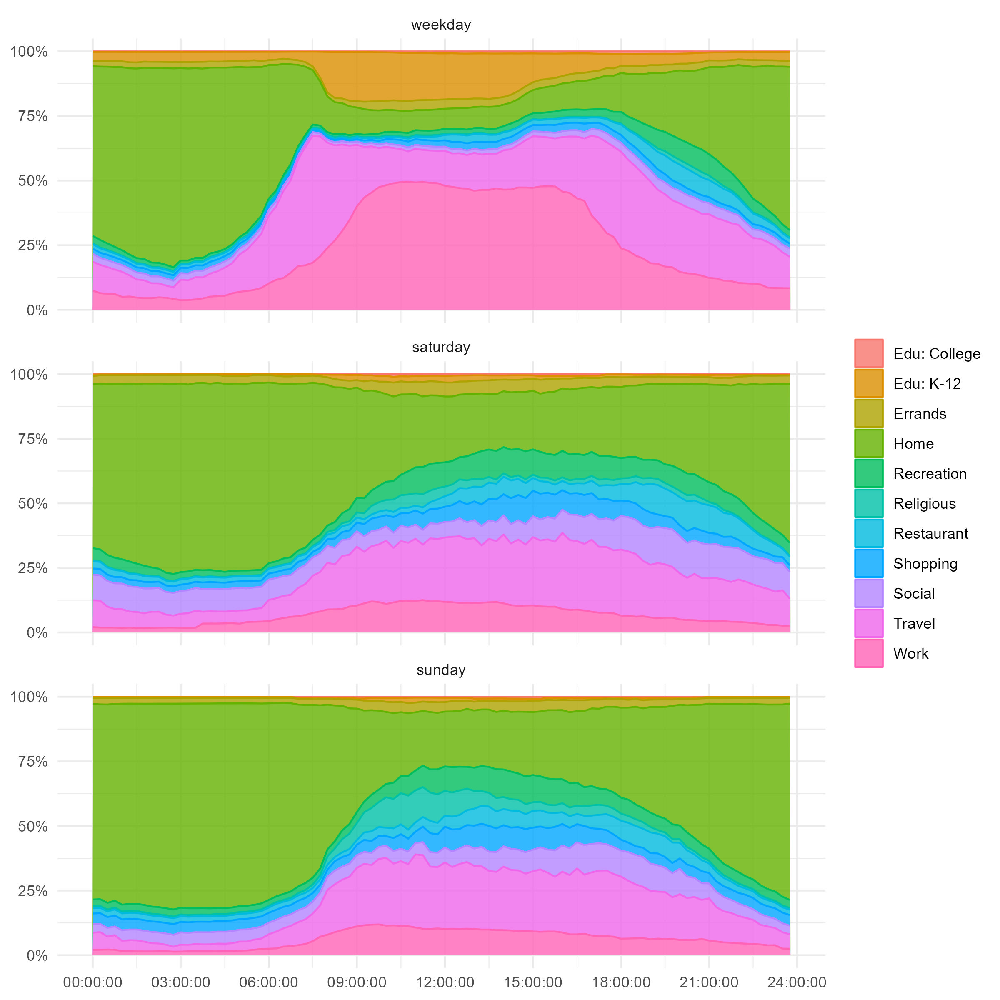
```

Weights for individuals are derived from the person-weights in the survey, which are stratified into weekday, Saturday, and Sunday weights. Similar to the trip weights, we divide the weekday person weights by the number of weekdays completed in the survey so that they reflect a typical day of travel and inferred activity participation on that typical day. While we refer to the PASTA results below as "population-level" estimates, we recognize that the application of person-weights (or alternatively trip weights for forward- and reverse-cone trips) from the travel survey to imputed activity episodes is one for which the original survey weights were not designed. Nevertheless, we use this survey to demonstrate the PASTA method as it strikes a balance between providing a large sample size and a reasonably rich accounting of work and non-work travel over multiple days. Moreover, its availability as an open data product facilitates the replicability of this work.

### Space-time Paths

With the episodes inferred, they can now be associated with geometry attributes to create spacetime paths. The survey contains a Census Block Group identifier for the start and end of trips, which we infer into the activity episodes in the process outlined above. Next, the centroids of the Block Group polygons are used as representative points at the start and end of an activity episode and the start and end times of the activity are used as a height attribute. After converting time into a spatial distance measure, with each minute represented as one metre in height, these start and end point coordinates are connected to form 3D line features. An example of this is shown in @fig-spacetimepath for the hypothetical individual's activity episodes shown in @tbl-episode_table with the figure generated in ArcGIS Pro.

```{r}
#| label: fig-spacetimepath
#| fig-cap: "Example Space-time Path based on Inferred Activities"
#| echo: false
#| out-width: 100%

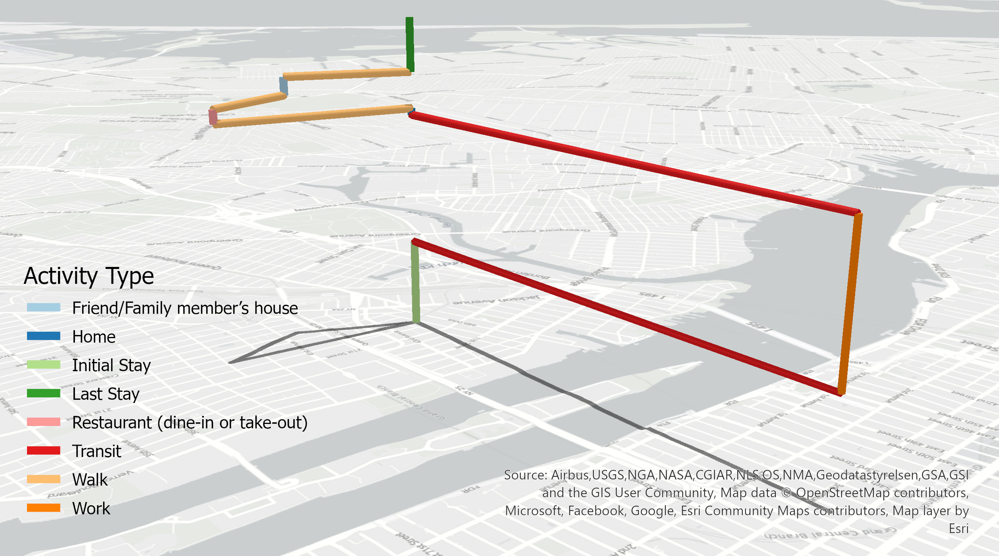
```

### Identifying Flexible Activities

With the activity episodes created and associated with their space-time path geometries, the last step involves determining fixed and flexible activity episodes, which are key elements to identify anchors [@hagerstrand1970; @miller2004]. While earlier time-geographic studies typically treated home- and workplace-based episodes as fixed activities [@neutens2007] - because of the higher capability, coupling, and authority constraints associated with these activities compared to others - this convention has recently been criticized, particularly with increasing complexity in daily activities [@zhang2022]. Therefore, instead of setting general rules of fixed and flexible activities for PASTA, we emphasize that researchers should determine these activities according to research aims and available data. This study followed the work of @kim2003 and took obligation activities as fixed activities, including several place types, i.e., home, work, attending school, daycare, college, or university, visiting a friend or family member's house, hospitals, work-related places, places of worship, and running errands. Correspondingly, out-of-home discretionary activities are treated as flexible activities, including shopping, visiting restaurants, and recreation or entertainment.

Following the classification of fixed and flexible activities, pairs of anchor points on either side of flexible activities were identified. This involved several steps. First, a general data cleaning exercise was undertaken to flag episodes where breaks in the temporal sequence and stay-trip-stay-trip cadence were broken. This included identifying stay episodes with different start and end locations, identifying if an implied trip occurred by examining whether the start activity type of an episode matched the end activity type of the previous episode, flagging any episodes where a missed survey day is implied through activity durations longer than 24 hours, and flagging any activity durations that were above the 99th percentile of those contained among valid episodes.

Next, we extracted sequences of flexible activities from the valid time path segments consisting of a main activity bounded by a trip to and from that activity. If individuals engaged in several flexible activities as part of a trip and episode chain, the entire chain was identified. This results in `r flex_segments |> nrow() |> prettyNum(big.mark = ",")` total (unweighted) flexible activity segments across the weekday, Saturday, and Sunday travel days (@tbl-flex_segments). From this, we extract the time, location, and trip mode associated with the start and end points of the flexible activity sequence and calculate the time budget available for travel and engaging in flexible activities between the space-time anchors. Individual STPs can then be generated between these anchor pairs.

```{r}
#| label: tbl-flex_segments
#| tbl-cap: "Descriptive Statistics for Flexible Activity Episodes by Survey Day"
#| echo: false
#| warning: false

tbl_note = "*Person-weights applied in calculation"

flex_segments |>
  separate(
    col = id,
    into = c("person_id", "timeblock_id", "flexseq_id"),
    sep = "_"
  ) |>
  mutate(person_id = as.numeric(person_id)) |>
  left_join(nycts_person_seds, by = "person_id") |>
  filter(start_trip_mode != "OTHER") |>
  mutate(
    start_trip_mode = fct_drop(start_trip_mode),
    start_trip_mode = fct_recode(
      start_trip_mode,
      Walk = "WALK",
      Bicycle = "BICYCLE",
      Transit = "TRANSIT",
      Car = "CAR"
    ),
    time_budget = as.numeric(time_window),
    gender = fct_collapse(gender, Other = c(
      "Do not identify with male or female", "Other"
    )),
    std_wday = case_when(
      wday(start_datetime) == 1 ~ "Sunday",
      wday(start_datetime) == 7 ~ "Saturday",
      TRUE ~ "Weekday"
    ),
    std_wday = fct_relevel(std_wday, "Weekday", "Saturday", "Sunday")
  ) |>
  select(
    `FC trip mode` = start_trip_mode, 
    #Gender = gender, Age = age, 
    `Household income` = hh_income,
    `Time budget (mins)*` = time_budget, 
    `Number of episodes*` = num_episodes,
    weights = per_weight,
    std_wday) |>
  modelsummary::datasummary_balance(formula = ~ std_wday, notes = tbl_note)
```

## Voxel-based Multimodal STPs

While STPs are classically represented using features rooted in vector geometry (e.g. cones, cylinders), the data model underpinning this work builds on that of @downs2013 and @loraamm2020 and is voxel-based. In this case, voxels are made up of raster cells with a fixed spatial resolution with heights defined by discrete intervals in the time dimension. To demonstrate the PASTA measure, we adopt a spatial resolution of 100m x 100m and a temporal resolution of 5 minutes, which we also use as the minimum activity duration $a_{min}$. To operationalize this structure and calculate individual STPs, we first rasterize the New York City study area with the raster centroids becoming the intermediate locations $j$ in the calculations below.

Second, we calculate the forward cone associated with travel away from an anchor location to engage in flexible activities. For this, we utilize the {r5r} package [@pereira2021] and $R^5$ routing engine [@conway2017; @conway2018] to calculate a travel time matrix based on the start location ($x_i, y_i$), start datetime $t_i$, and travel mode $m_i$ associated with the first trip in the flexible activity episode chain for person $p$. The maximum travel duration is set to the time budget and destinations consist of the intermediate raster cells, which we assume are available for interaction at all times of the day. The {r5r} package and $R^5$ routing software allows for efficient computation of one-to-many travel times within a realistic transportation network by different travel modes, including walking, cycling, transit (based on GTFS schedules), and car. For transit routing, a small time-window of 15 minutes is used to help offset the modifiable temporal unit problem associated with rigid transit schedules [@pereira2019]. For car, travel times are based on an assumption of free-flow traffic, as detailed congestion data is not available to the research team. The resulting travel time matrix returns the travel time $t_{ij}$ between $i$ and all intervening opportunity raster cell locations $j$ within the time budget.

Third, we calculate the reverse cone for travel between the intervening raster cells and the destination anchor. Here, another travel time matrix is calculated based on the end location ($x_k, y_k$), end datetime $t_k$, and travel mode $m_k$ associated with the last trip in the flexible activity episode chain for person $p$. Notably, the approach taken for the forward cone is adjusted for the reverse cone routing. The {r5r} package, as currently implemented, relies on departure times for trips and excels at one-to-many routing for achieving fast computational times. This makes returning $t^*_{ij}$ a fairly rapid process. On the contrary, computing $t^*_{jk}$ - a many-to-one routing from many intermediate cells $j$ to the destination anchor $k$ - is comparatively slow. In the absence of an "arrive-by" datetime option for routing, our current approach is to assume an isotropic network [@miller2009] and take the destination anchor as the origin in the calculations, that is, $t^*_{jk} = t^*_{kj}$. We argue that, while not ideal, this approach is acceptable for routing by walking, cycling, and car, particularly over relatively flat terrain. Still, we recognize that some bias is unavoidable as there is clear potential for different travel times between inbound and outbound trips which may take different paths.

However, because transit services in the routing software are schedule-based, they are strongly anisotropic. This means a simple swapping of origins and destinations would create a strong potential for calculating incorrect travel times by transit, potentially necessitating the use of slower one-to-many routing. A novel way to address this is to reverse the "arrow of time" within the GTFS files, that is, to reverse departure times and trip progressions to make public transit "run backwards". Reversing time values is accomplished by taking the absolute differences between hour, minute, and second values:

$$
HH:MM:SS_{reverse} =  |HH:MM:SS - 23:59:59|
$$

\noindent and applying this conversion to all departure and arrival times in the GTFS trip stop time tables. In addition to reversing the departure times of transit, the trip sequences in the GTFS files also need to be reversed. From this, a second "reverse time" network is built using the reversed transit services. When converting the original arrival time at $t_k$ to its reverse and using that as the departure time in the routing, this has the effect of enabling faster calculations for the reverse cone travel time matrix for transit. This is particularly appealing in the current study area given the large survey sample size, high spatial resolution for the intermediate cells $j$, and the high transit mode share. However, it does come at the computational cost of storing two networks (forward and reverse time) in memory for routing.

After calculating the reverse cone travel time matrix, we join the forward and reverse cone travel time matrices to the intervening raster cells, with each $j$ now associated with the forward travel time $t_{ij}$ required to reach the cell from the origin anchor and the travel time $t_{jk}$ required to reach the destination anchor from the intervening opportunity location. From this, the total potential dwell time for interaction at the location can be calculated as the time budget minus the forward and reverse travel times ($b_{ik} - (t_{ij} + t_{jk})$). Finally, the voxels are created by dividing the total dwell time at a location by the time interval, returning the number of voxels to populate in space and time between the forward and reverse cones at a given location.

As the routing and voxel creation function iterates across each of the flexible activity sequences, the voxels are saved to disk in an Arrow dataset, which facilitates compressed storage and larger-than-memory streaming calculations [@wickham2023]. When the creation of the space-time voxels is complete, we then use this dataset as a foundation for creating multidimensional arrays that represent the STPs. These arrays take the form:

$$
\text{dwell time}(x, y, t, d, m, p) 
$$ {#eq-dwell_time_xy}

\noindent with the dwell time at any individual voxel indexed by the $x$ and $y$ spatial dimensions, the $d$ date and $t$ time dimensions, the travel mode $m$ associated with the forward cone, and a person identifier $p$. For the hypothetical space-time path shown above, and using a higher resolution of 10m x 10m x 5 minutes, this translates into a voxel-based spacetime prism (@fig-ex_spacetimeprism) that encompasses the locations and time available for interaction within the flexible time window between $17:15:00$ and $18:35:00$, accounting for their selected mode choices. For this figure, we have clipped the spacetime path to focus on the flexible activity sequence and exaggerated the height of the voxels to better show their shape within the forward and reverse cones. The PPA in @fig-ex_spacetimeprism is the projection of the STP into 2D space. This PPA is traditionally used as the basis for some person-based measures of accessibility, such as capturing its size to reflect the area within which an individual can potentially engage in activities or counting the number of destination opportunities contained within the PPA extent.

```{r}
#| label: fig-ex_spacetimeprism
#| fig-cap: "Example Voxel-based Space-time Prism for Flexible Activities"
#| echo: false
#| out-width: 100%

# ADD REPRODUCIBILITY NOTES: HOW WAS THIS PLOT CREATED? DESCRIBE THE DATA USED TO CREATE THIS PLOT, AND THE SOFTWARE. IF POSSIBLE INCLUDE THE CODE
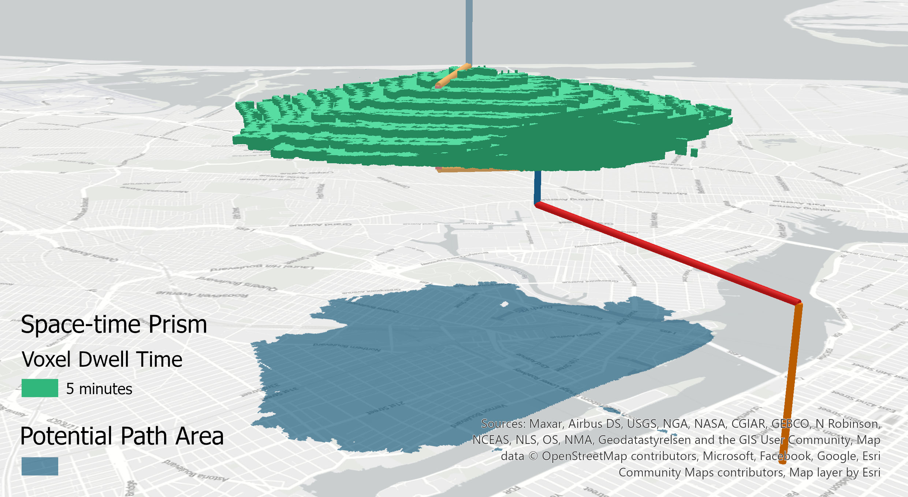
```

## PASTA

```{=html}
<!---
I wondered if we want to put this before the data and make it more general?
E.g., change the dwell time into interaction potential(x, y, t, p, s)
s refers to service availability. p refers to person-level interaction utility.
And then we could say we use dwell time as an indicator of interaction potential.

Some texts could be useful:
It should be noted that the dwell time is used as an indicator of the potential for interaction at a certain location in this study as an example. More complex indicators may integrate the service availability and usage ulities to get a more realistic measure of interaction potential.
--->
```

Beyond the calculation of voxel-based space-time prisms and raster-based PPAs, the discretization of space and time in the voxel data model is critical for enabling the calculation of PASTA based on a variety of different aggregation strategies. For example, for a given person $p = 1$, the dwell time available at an intermediate location $x, y$ for a typical weekday is calculated from the multidimensional array as:

$$
A_{x, y} = \sum^T_{t=1} \sum^M_{m=1} \text{dwell time}(x, y, t, d = \text{weekday}, m, p = 1)
$$ {#eq-pasta_wd_over_tm}

\noindent which corresponds to a person-based accessibility measure for the underlying raster places calculated by summing dwell time over the time and mode dimensions. The result of this calculation using the sample prism above is shown in @fig-ex_pasta_1. In this case, the underlying 2D raster made up of the intervening opportunity cells is used to reflect not only the spatial extent of the PPA but also the sum of the potential dwell time available for engaging in activities at that location, given the individual's space-time constraints.

```{r}
#| label: fig-ex_pasta_1
#| fig-cap: "Example Voxel-based Space-time Prism for Flexible Activities"
#| echo: false
#| out-width: 100%
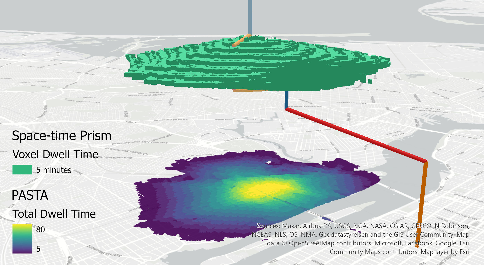
```

This dwell time raster is a measure of person-based aggregate space-time accessibility, or PASTA, for one person. The units reflect the minutes an individual can spend at a given location given their time budget for participating in flexible activities while travelling between anchors using their selected modes of travel for forward- and reverse-cone trips.

From here, different person-based measures of accessibility could be calculated for person $p=1$, such as the count of activities or their total dwell time available for interaction within the PPA [^1]. However, the full potential of PASTA as a person-based and population-level measure of place-based access is unlocked by performing aggregations of the voxel-based space-time prisms over the different dimensions and person attributes of the array. For example, @eq-pasta_wd_over_tm can be updated to sum over multiple individuals $p$:

[^1]: It has been suggested by our colleague Michael Widener that we refer to the results of the PASTA measure as Cumulative Accessibilities by Raster Bins, or CARBs

$$
A_{x,y} = \sum^T_{t=1} \sum^M_{m=1} \sum_{p=1}^{P}  \text{dwell time}(x, y, t, d = \text{weekday}, m, p)
$$ {#eq-pasta_wd_over_tmp}

The result of this calculation for two prisms is shown in @fig-ex_pasta_2 with the total dwell time for a typical weekday based on the aggregation over the time, forward cone mode, and person dimensions.

```{r}
#| label: fig-ex_pasta_2
#| fig-cap: "Example Voxel-based Space-time Prism for Flexible Activities"
#| echo: false
#| out-width: 100%
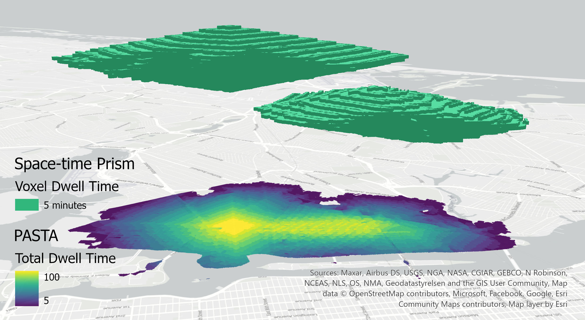
```

While the dwell time is equal to the temporal resolution of the time dimension (5 minutes in this case), storing the dwell time as an attribute enables the calculation of weighted dwell time using the person weights $w(p, d)$, which themselves are indexed by person $p$ and day of travel $d$ (weekday, Saturday, Sunday). Using the example of a weekday, @eq-pasta_wd_over_tmp becomes:

$$
A^w_{x,y} = \sum^T_{t=1} \sum_{m=1}^{M} \sum^P_{p=1} w(p, d = \text{weekday}) \times \text{dwell time}(x, y, t, d = \text{weekday}, m, p)
$$ {#eq-w_pasta_wd_over_tmp}

to return PASTA in units of person- or population-weighted dwell times.

With the underlying travel survey data used to inform the individual STPs, PASTA can be calculated in a variety of other different ways. For example, PASTA can be calculated by aggregating over individuals $p$ to return the weighted potential dwell times over the different days, travel periods, or modes used for travel in the forward cone, such as $m = \text{transit}$:

$$
A^w_{x,y} = \sum^T_{t=1} \sum_{p=1}^{P} w(p, d = \text{weekday}) \times \text{dwell time}(x, y, t, d = \text{weekday}, m = \text{transit}, p)
$$ {#eq-w_pasta_wd_transit_over_tp}

Further richness is also unlocked by associating the prisms with additional individual-level information, such as their age, gender, ethnicity, disability status, or household income. In this case, we could return PASTA for low-income individuals who used transit (in the forward-cone direction) for engaging in flexible activities on typical weekday:

$$
A^w_{x,y} = \sum^T_{t=1} \sum_{p \in \text{low income}} w(p, d = \text{weekday}) \times \text{dwell time}(x, y, t, d = \text{weekday}, m = \text{transit}, p)
$$ {#eq-w_pasta_wd_transit_over_tp_low_income}

We explore these and other formulations of PASTA in the results.

## Gravity-based Accessibility

In addition to PASTA, we also calculate more traditional measures of gravity-based accessibility for comparison. The results of these measures serve as benchmarks against which PASTA can be compared and contextualized. For place-based accessibility, we calculate a measure of market potential that takes the form:

$$
S^m_{j} = \sum_{i=1}^I P_i \times f^m(t_{ij}^m)
$$

\noindent where $P_i$ is the population at origin census block groups. This measure of population interaction potential is discounted by some function $f$ of the travel time $t_{ij}$ between origin place $i$ and destination $j$ using a given travel mode $m$.

For the impedance function $f$, we adopt a positive approach and calibrate it to the travel times calculated for individual shortest trip paths to flexible activities from the travel survey using {r5r} while recognizing the date, time, trip weight, and mode used for the trips. The resulting impedance function is based on the probability density and cumulative distribution functions of the travel times with trip weights for each mode and survey day and takes the form $f = 1-CDF$. The impedance functions calibrated for weekday travel to flexible activities are shown in @fig-place_impedance.

```{r}
#| label: prepare_fig_place_impedance
#| echo: false
#| eval: true
ggsave(pdf_cdf_plot, filename = "./img/pdf_cdf_plot.jpg", width = 6, height = 4, dpi = 300)
```

```{r}
#| label: fig-place_impedance
#| fig-cap: "Probability Density and Calibrated Impedance Functions"
#| echo: false
#| out-width: 80%
#| warning: false

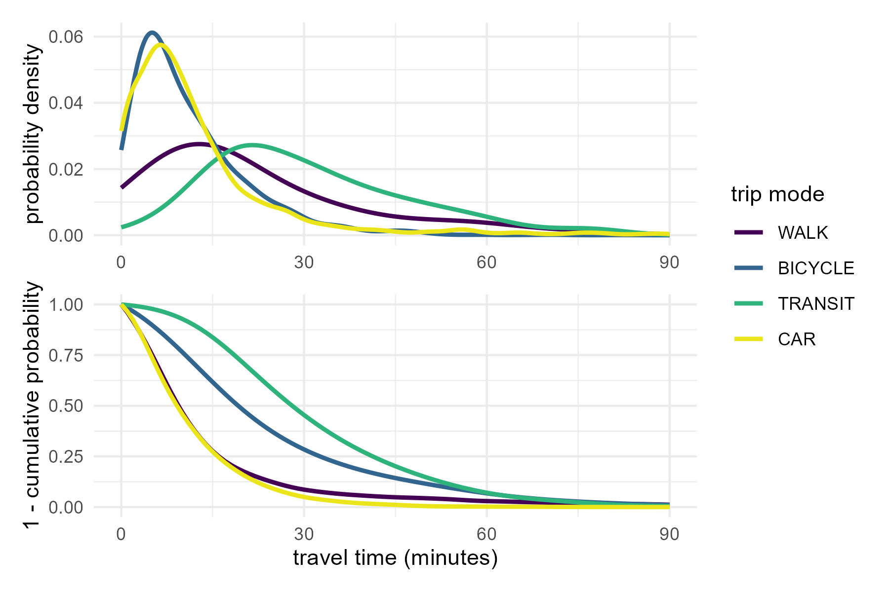
```

# Results

After filtering the episodes and space-time paths to capture the time window available for engaging in flexible activities, PASTA was calculated across all three survey days. The resulting aggregations of PASTA are displayed across several themes below.

## PASTA by Day

The first set of results is displayed in @fig-pasta_by_day, which shows PASTA aggregated over all individuals, modes, and the time dimension across the three survey days. At first glance, the results appear similar to those one might obtain from a traditional gravity-based measure of access. However, the PASTA measure reflects a place-based aggregation of person-based accessibility and the interpretation differs in two key ways. First, the units reflected on the map consist of the total supply of population time available for potentially engaging in flexible activities at the raster cell locations. Because PASTA is aggregated over all person-weighted minutes, the totals (in millions of minutes) can be interpreted to reflect population-level estimates of accessibility as the time available for engaging in flexible activities at the intermediate locations. Second, compared to gravity-based measures, the PASTA results are more theoretically consistent in that they incorporate aspects of all four components of accessibility, including individual space-time constraints, mode choices and the characteristics of the transportation system, and land uses based on anchor types and locations.

The spatial patterns in the results show a general peaking in accessibility around lower Manhattan. Outside of the core, the magnitude of potential dwell time radiates outwards around the city's subway lines and decreases as locations get beyond walking distance of station access points. Overall, the magnitudes across the survey days highlight how individuals generally have more time to engage in flexible activities on Saturday. There is also a more even distribution of potential dwell time on Saturday and Sunday whereas for weekdays the potential tends to be more concentrated around the core, where many people work, and the transit lines many of these workers use to get to and from their jobs.

```{r}
#| label: prepare fig_ppas_by_day
#| eval: true
#| echo: false

fig_pasta_by_day <- tm_shape(pasta_by_day |> select("w_dwell_time")) +
  tm_raster(
    col = "w_dwell_time",
    col.free = TRUE,
    col.scale =
      tm_scale_continuous(
        values = "viridis",
        label.format = list(digits = 0, big.num.abbr = c("mln" = 6, "K" = 3))
      ),
    col.legend = tm_legend(
      height = 8,
      title = "",
      frame = FALSE
      )
  ) +
  tm_shape(boundaries_boroughs) + tm_polygons(fill = "grey25", zindex = 1) +
  tm_shape(boundaries_base) + tm_polygons(fill = "grey30", zindex = 2) +
  tm_layout(
    bg.color = "grey15",
    #legend.bg.color = NA,
    legend.bg = FALSE,
    legend.bg.alpha = 0,
    legend.position = c("left", "top"),
    legend.text.color = "white",
    panel.label.frame = FALSE,
    #panel.label.bg.color = NA,
    panel.label.bg = FALSE,
    between.margin = 0.2
  )

tmap_save(
  fig_pasta_by_day,
  width = 10,
  height = 3.5,
  dpi = 300,
  filename = "./img/fig_pasta_by_day.jpg"
)
```

```{r}
#| label: fig-pasta_by_day
#| fig-cap: "PASTA-based Population-weighted Dwell Time (minutes) by Day"
#| echo: false
#| out-width: 100%
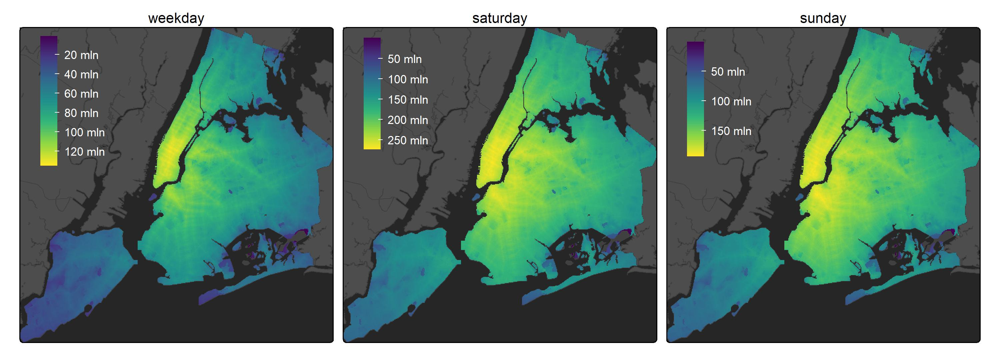
```

## PASTA by Day and Time Period

To further explore the temporality of the results, @fig-pasta_by_period_and_day displays aggregations of PASTA over people and modes across the main activity periods of a typical weekday. Here results suggest that the greatest amount of flexible time occurs within the midday period followed by the PM peak and evening periods. Per the tempograms in @fig-tempograms, this is when many individuals leave work and engage in more flexible activities. There is considerably less flexible time available within individual activity schedules for travel between anchors in the morning peak relative to the midday and afternoon.

```{r}
#| label: prepare fig_pasta_by_period_and_day
#| eval: true
#| echo: false

fig_pasta_by_period_and_day <- tm_shape(pasta_by_period_and_day |> 
                                          filter(std_wday == "weekday") |> 
                                          filter(period != "early (3am to 7am)") |> 
                                          filter(period != "late (10pm to 3am)") |> 
                                          select("w_dwell_time")) +
  tm_raster(
    col = "w_dwell_time",
    col.free = FALSE,
    col.scale =
      tm_scale_continuous(
        values = "viridis",
        label.format = list(digits = 0, big.num.abbr = c("mln" = 6, "K" = 3))
      ),
    col.legend = tm_legend(
      height = 8, 
      title = "", 
      frame = FALSE) #title = "Dwell Time \n(minutes)")
  ) +
  tm_shape(boundaries_boroughs) + tm_polygons(fill = "grey25", zindex = 1) +
  tm_shape(boundaries_base) + tm_polygons(fill = "grey30", zindex = 2) +
  tm_facets(nrow = 2)+
  #tm_facets_flip(ncol = 3) +
  tm_layout(
    bg.color = "grey15",
    #legend.bg.color = NA,
    legend.bg = FALSE,
    legend.bg.alpha = 0,
    legend.frame = FALSE,
    #legend.position = c("left", "top"),
    #legend.text.color = "white",
    panel.label.frame = FALSE,
    #panel.label.bg.color = NA,
    panel.label.bg = FALSE,
    between.margin = 0.2
  )

tmap_save(
  fig_pasta_by_period_and_day,
  width = 11,
  height = 6,
  dpi = 300,
  filename = "./img/fig_pasta_by_period_and_day.jpg"
)
```

```{r}
#| label: fig-pasta_by_period_and_day
#| fig-cap: "PASTA-based Population-weighted Dwell Time (minutes) by Period for a Weekday"
#| echo: false
#| out-width: 100%
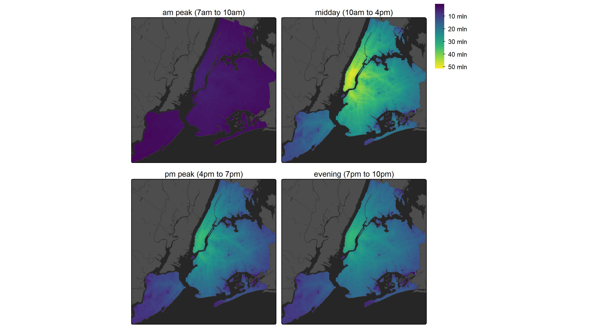
```

## PASTA by Day and Mode

How do individual travel mode use choices contribute to potential dwell time? @fig-pasta_by_mode_and_day displays the population-weighted dwell times associated with each survey day and the mode used in the forward-cone of travel from origin anchor locations. From these results, several interesting patterns emerge. First, for walking, weekday results are largely concentrated around lower Manhattan which likely contains the workplace anchor for many respondents. However, the dwell time pattern gradually shifts outwards into Brooklyn and Queens over Saturday and Sunday where more trips are likely starting and ending around home anchors rather than workplace locations.

Results for transit are generally consistent across days, although the magnitude of potential dwell time is larger for those using transit for travel from their origin anchor on Saturday compared to the weekday and Sunday travel days. Travel by car tends to be associated with high dwell time potential throughout the city. Generally higher concentrations of dwell time can be seen in Queens and Brooklyn and car use is also associated with the greatest potential for locations in Staten Island. In contrast to the other modes, cycling use tends to be associated with the lowest amount of dwell time potential across survey days. While the speed of the mode spreads the potential to engage in activities over a larger area than walking, the results indicate generally lower use of this mode for engaging in flexible activities in the survey.

```{r}
#| label: prepare fig_pasta_by_mode_and_day
#| eval: true
#| echo: false

fig_pasta_by_mode_and_day <- tm_shape(pasta_by_mode_and_day |>
           select("w_dwell_time")) +
  tm_raster(
    col = "w_dwell_time",
    col.free = TRUE,
    col.scale =
      tm_scale_continuous(
        values = "viridis",
        label.format = list(digits = 0, big.num.abbr = c("mln" = 6, "K" = 3))
      ),
    col.legend = tm_legend(height = 8, title = "", frame = FALSE)
  ) +
  tm_shape(boundaries_boroughs) + tm_polygons(fill = "grey25", zindex = 1) +
  tm_shape(boundaries_base) + tm_polygons(fill = "grey30", zindex = 2) +
  tm_layout(
    bg.color = "grey15",
    legend.bg = FALSE,
    legend.bg.alpha = 0,
    legend.position = c("left", "top"),
    legend.text.color = "white",
    panel.label.frame = FALSE,
    panel.label.bg = FALSE,
    between.margin = 0.2
  )

tmap_save(
  fig_pasta_by_mode_and_day,
  width = 10,
  height = 7,
  dpi = 300,
  filename = "./img/fig_pasta_by_mode_and_day.jpg"
)
```

```{r}
#| label: fig-pasta_by_mode_and_day
#| fig-cap: "PASTA-based Population-weighted Dwell Time by Mode and Day"
#| echo: false
#| out-width: 100%
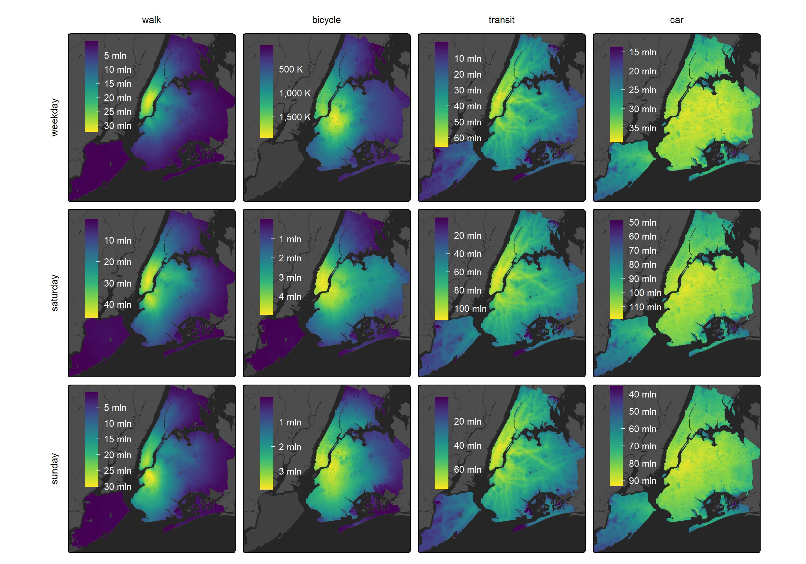
```

## PASTA by Day and Income

As a final example, @fig-pasta_by_income_and_day shows results person-weighted potential dwell times aggregated according to individual household income for a typical weekday. Here, results demonstrate that individuals in the highest income band tend to have the highest potential dwell time for interacting with places. Notably, these results are sensitive to not only the transportation and land use components of accessibility and the space-time constraints of individuals but also the number of individuals within each income group.

```{r}
#| label: prepare fig_pasta_by_income_and_day
#| eval: true
#| echo: false

fig_pasta_by_income_and_day <- tm_shape(
  pasta_by_income_and_day |> 
    filter(std_wday == "weekday") |> 
    #filter(!is.na(hh_income_6)) |> 
    select("w_dwell_time")) +
  tm_raster(
    col = "w_dwell_time",
    #col.free = TRUE,
    col.scale =
      tm_scale_continuous(
        values = "viridis",
        label.format = list(digits = 0, big.num.abbr = c("mln" = 6, "K" = 3))
      ),
    col.legend = tm_legend(height = 8, title = "", frame = FALSE) #title = "Dwell Time \n(minutes)")
  ) +
  tm_shape(boundaries_boroughs) + tm_polygons(fill = "grey25", zindex = 1) +
  tm_shape(boundaries_base) + tm_polygons(fill = "grey30", zindex = 2) +
  tm_facets(nrow = 2) +
  #tm_facets_flip(nrow = 2) +
  tm_layout(
    bg.color = "grey15",
    legend.bg = FALSE,
    legend.bg.alpha = 0,
    #legend.position = c("left", "top"),
    #legend.text.color = "white",
    panel.label.frame = FALSE,
    panel.label.bg = FALSE,
    between.margin = 0.2
  )

tmap_save(
  fig_pasta_by_income_and_day,
  width = 11,
  height = 6,
  dpi = 300,
  filename = "./img/fig_pasta_by_income_and_day.jpg"
)
```

```{r}
#| label: fig-pasta_by_income_and_day
#| fig-cap: "PASTA-based Population-weighted Dwell Time by Income for a Weekday"
#| echo: false
#| out-width: 100%
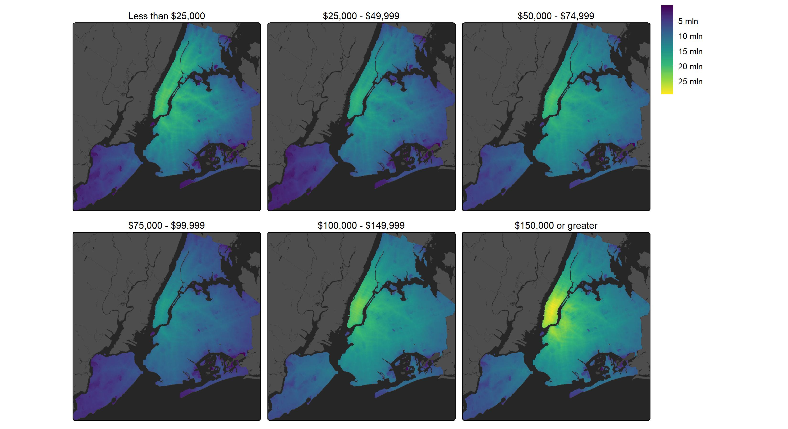
```

## PASTA vs Gravity-based Accessibility

How do the results of the PASTA-based analysis presented above compare with those obtained from a conventional place-based accessibility framework? @fig-pasta_place_weekday_stars presents a comparison between a gravity-based measure of market potential that reflects the impedance-weighted population from origin Block Groups $i$ that can access to the intermediate cells $j$ and PASTA-based dwell time estimated for the same intermediate cells. These results are aggregated over all modes for a typical weekday. At first glance, and setting aside the differences in methods and units, the spatial patterns appear broadly similar across the PASTA and gravity-based measures. Locations where people have potential dwell time also tend to be places that more population can access by the different modes. This correspondence is reinforced in the scatterplot in @fig-place_scatter_total, where dwell time and gravity-based accessibility display a clear positive association. 

```{r}
#| label: prepare fig_pasta_place_weekday_stars
#| eval: true
#| echo: false

fig_pasta_place_weekday_stars <- tm_shape(
  pasta_place_weekday_stars) + 
    #filter(std_wday == "weekday") |> 
    #filter(!is.na(hh_income_6)) |> 
    #select("w_dwell_time")) +
  tm_raster(
    #col = "w_dwell_time",
    col.free = TRUE,
    col.scale =
      tm_scale_continuous(
        values = "viridis",
        label.format = list(digits = 0, big.num.abbr = c("mln" = 6, "K" = 3))
      ),
    col.legend = tm_legend(height = 8, title = "", frame = FALSE) #title = "Dwell Time \n(minutes)")
  ) +
  tm_shape(boundaries_boroughs) + tm_polygons(fill = "grey25", zindex = 1) +
  tm_shape(boundaries_base) + tm_polygons(fill = "grey30", zindex = 2) +
  tm_facets(nrow = 1) +
  #tm_facets_flip(nrow = 2) +
  tm_layout(
    bg.color = "grey15",
    legend.bg = FALSE,
    legend.bg.alpha = 0,
    legend.position = c("left", "top"),
    legend.text.color = "white",
    panel.labels = c("total market potential", "total dwell time"),
    panel.label.frame = FALSE,
    panel.label.bg = FALSE,
    between.margin = 0.2
  )

tmap_save(
  fig_pasta_place_weekday_stars,
  width = 10,
  height = 3.5,
  dpi = 300,
  filename = "./img/fig_pasta_place_weekday_stars.jpg"
)
```

```{r}
#| label: fig-pasta_place_weekday_stars
#| fig-cap: "Gravity-based Market Potential Accessibility and PASTA-based Dwell Time for a Weekday"
#| echo: false
#| out-width: 100%
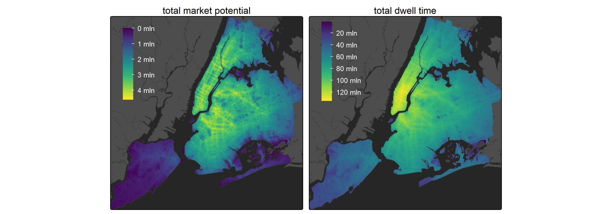
```

```{r}
#| label: prepare_fig_place_scatter_total
#| echo: false
#| message: false
#| eval: true
#place_scatter_total
pasta_place_access_scatter_total <- pasta_place_by_mode_weekday |> 
  drop_na(grav_markpop, w_dwell_time) |> 
  group_by(x, y) |> 
  summarize(grav_markpop = sum(grav_markpop), w_dwell_time = sum(w_dwell_time)) |>
  ungroup() |> 
  ggplot(aes(x = grav_markpop, y = w_dwell_time)) + 
  geom_point(size = .1, alpha = 0.05) +
  #facet_wrap(vars(trip_mode), scales = "free") +
  scale_x_continuous(
    name = "gravity-based market potential accessibility", 
    labels = scales::unit_format(unit = "M", scale = 1e-6)) +
  scale_y_continuous(
    name = "population-weighted dwell time", 
    breaks = seq(0, 150000000, by = 25000000),
    labels = scales::unit_format(unit = "M", scale = 1e-6)) +
  viridis::scale_color_viridis(discrete = TRUE, option = "D", end = .97) +
  #guides(colour=guide_legend(title="trip mode", override.aes=list(size=1, alpha = 1))) +
  theme_minimal()

ggsave(
  pasta_place_access_scatter_total, 
  filename = "./img/pasta_place_access_scatter_total.jpg", 
  width = 6, height = 4, dpi = 300)
```

```{r}
#| label: fig-place_scatter_total
#| fig-cap: "Total PASTA vs. Gravity-based Market Potential Accessibility"
#| echo: false
#| out-width: 90%
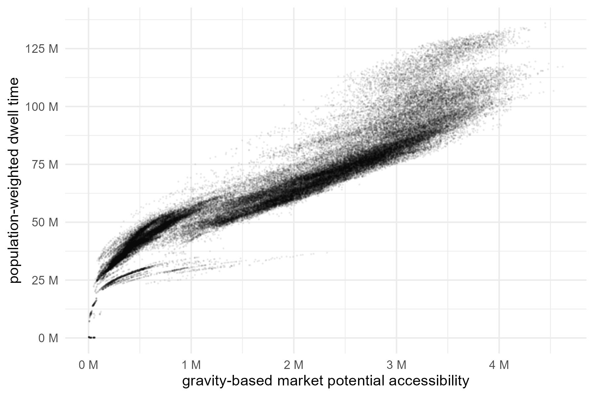
```

This broad correspondence is not unexpected as both measures are ultimately shaped by the same underlying spatial organization of employment, population density, and multimodal transport connectivity that concentrates interaction potential in the city's major urban centres. In this regard, a well-specified gravity-based accessibility measure of market potential, including an impedance function calibrated to observed travel durations for flexible trips, appears to correspond well to the dwell times obtained from the PASTA measure. 

However, there are important differences in the intensity and spatial diffusion of accessibility, with the PASTA-based measure of dwell time displaying a more dramatic peak in central and lower Manhattan, an area where many individuals have work locations. Likewise, the spatial distribution of dwell time radiates outwards from the core in a smoother fashion. Investigations of the scatterplot and the spatial locations of the plotted points were undertaken to further contextualize these patterns. While most scatterplot points fall along a general accessibility–dwell time gradient, some highly accessible locations in the upper-right of the distribution support greater potential temporal utilization than their market potential alone would imply. These data points correspond to the central and lower Manhattan cluster noted above. Likewise, the initial steepness at the lower-left where dwell time outpaces gravity-based access corresponds to locations in Staten Island and the Rockaways. Further investigations of the activity and time use profiles of individuals in these areas is required to fully understand these patterns. Conversely, there is some divergence in the lower-left of the plot, with some locations under-performing in attracting potential dwell time relative to their accessibility. Manual investigation of these cells indicates they are located in the Breezy Point private neighbourhood and in other more obscure areas such as the islands of Jamaica Bay, open space, and airport land that have some calculated access by car but relatively little potential dwell time.

These results are further broken down across the four modes, with @fig-place_by_mode_weekday and @fig-place_scatter showing gravity-based market potential accessibility calculated for a typical weekday within the survey period. The transit and car modes exhibit remarkable, if non-linear, relationships between these two measures, suggesting their market potential of places by these modes tends to align with the time individuals using these modes could spend there. For walking and cycling, however, the relationships are considerably less clear. Some locations exhibit a lower supply of potential dwell time than might be expected given their higher market potential, indicating that higher gravity-based access by active modes does not always translate into more person-based interaction potential. These gaps could reflect areas with unmet potential where, for example, improving walking and cycling infrastructure, safety, or network connectivity could help to attract more PASTA.

```{r}
#| label: prepare fig_place_by_mode_weekday
#| eval: true
#| echo: false

fig_place_by_mode_weekday <- tm_shape(place_marketpotential_by_mode_weekday_stars |> select("grav_markpop")) + tm_raster(
    col = "grav_markpop",
    col.free = TRUE,
    col.scale =
      tm_scale_continuous(
        values = "viridis",
        label.format = list(digits = 0, big.num.abbr = c("mln" = 6, "K" = 3))
      ),
    col.legend = tm_legend(height = 8, title = "", frame = FALSE)
  ) +
  tm_shape(boundaries_boroughs) + tm_polygons(fill = "grey25", zindex = 1) +
  tm_shape(boundaries_base) + tm_polygons(fill = "grey30", zindex = 2) +
  tm_facets(nrow = 2) +
  tm_layout(
    bg.color = "grey15",
    legend.bg = FALSE,
    legend.bg.alpha = 0,
    legend.position = c("left", "top"),
    legend.text.color = "white",
    panel.label.frame = FALSE,
    panel.label.bg = FALSE,
    between.margin = 0.2
  )

tmap_save(
  fig_place_by_mode_weekday,
  width = 6,
  height = 6,
  dpi = 300,
  filename = "./img/fig_place_by_mode_weekday.jpg"
)
```

```{r}
#| label: fig-place_by_mode_weekday
#| fig-cap: "Gravity-based Market Potential Accessibility by Mode for a Weekday"
#| echo: false
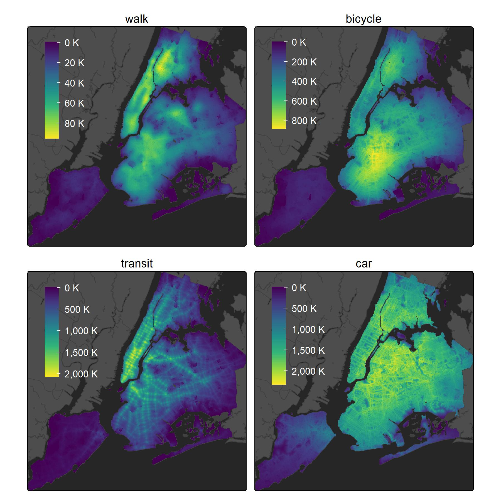
```

```{r}
#| label: prepare_fig_place_scatter
#| echo: false
#| eval: true

pasta_place_access_scatter <- pasta_place_by_mode_weekday |> 
  drop_na(grav_markpop, w_dwell_time) |> 
  ggplot(aes(x = grav_markpop, y = w_dwell_time, colour = trip_mode)) + 
  geom_point(size = .1, alpha = 0.05) +
  facet_wrap(vars(trip_mode), scales = "free") +
  scale_x_continuous(name = "gravity-based market potential accessibility", labels = scales::unit_format(unit = "M", scale = 1e-6)) +
  scale_y_continuous(name = "population-weighted dwell time", labels = scales::unit_format(unit = "M", scale = 1e-6)) +
  viridis::scale_color_viridis(discrete = TRUE, option = "D", end = .97) +
  guides(colour=guide_legend(title="trip mode", override.aes=list(size=1, alpha = 1))) +
  theme_minimal()

ggsave(pasta_place_access_scatter, filename = "./img/pasta_place_access_scatter.jpg", width = 6, height = 4, dpi = 300)
```

```{r}
#| label: fig-place_scatter
#| fig-cap: "PASTA vs. Gravity-based Accessibility by Mode"
#| echo: false
#| out-width: 90%
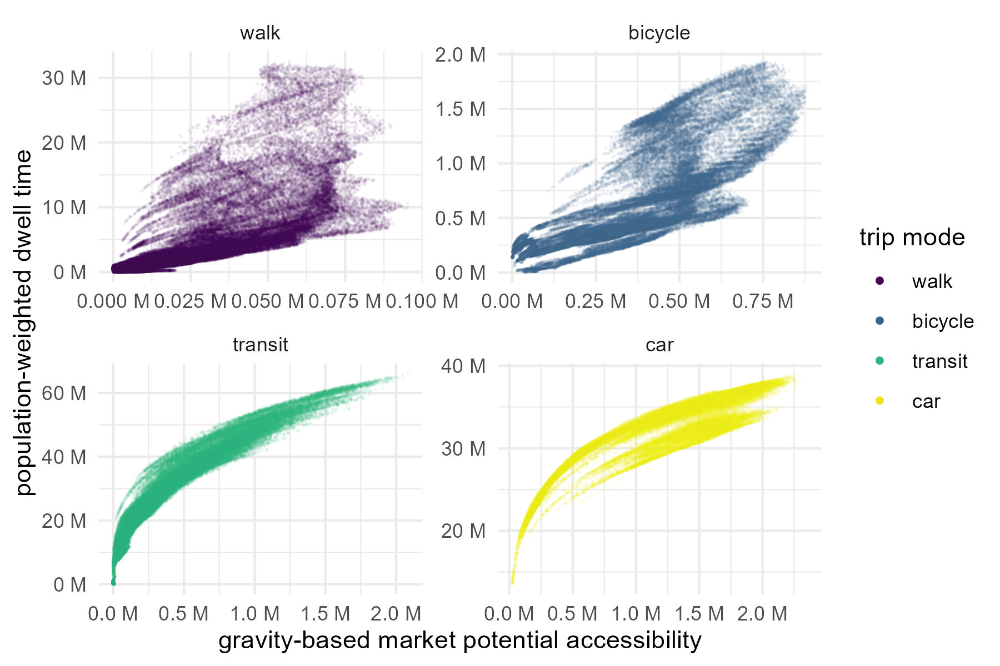
```

In general, the differences across each method arise because they capture distinct dimensions of accessibility. Gravity-based measures consider only the forward cones of travel inbound to or outbound from a location. Here, the spatial and temporal extent of the cone is limited only by the ability of each mode to facilitate travel between the origin and all other destinations and an impedance function accounting for the friction of distance. PASTA, on the other hand, considers a much richer accounting of the potential for interaction that captures not only for whether places can be reached but also the time available for engaging in activities once there. By incorporating individual anchors, flexible activity episodes, and space–time constraints into the calculation of place-based access, this person-based approach can capture the time-geographic aspects of accessibility for places that conventional gravity-based formulations tend to omit.

# Discussion and Conclusions

The concept of accessibility is the intensity of the potential to interact with the opportunities available at destination locations. Traditional place-based measures of accessibility, particularly the gravity-type measures, provide important insight into the functioning of transportation and land-use systems. However, because they ignore or only weakly represent individual and temporal components of access, they offer limited capacity to illuminate the relationships between people, places, and time. In contrast, person-based measures, grounded in time geography, capture the potential to interact with opportunities given transportation and land-use systems as well as individual space–time constraints. Still, such measures have traditionally exhibited high computational and data constraints as well as issues with communicability that prevent their widespread adoption in practice.

PASTA bridges these two perspectives by infusing place-based measures of accessibility with person-based foundations. Methodologically, the computational advances underpinning the approach enable the rapid calculation of STPs and PPAs associated with individual space-time activity episodes. The discretized time and space bins of the voxel-based data model supports aggregation from individual-level STPs to the large sample or population-scale to return more aggregate place-based measures of access. Compared to impedance-weighted opportunity units, PASTA, in its most basic form, measures accessibility in minutes representing the total potential dwell time available for engaging in activities at a location given individual space-time constraints and the characteristics of the transportation and land use systems. Conceptually, this measure links @hansen1959’s notion of the intensity of the possibility for interaction with Hägerstrand’s supply-side framing of population time [@ellegard2018, pp. 59-62], capturing the spatio-temporal distribution of potential population activity within the constraints of daily schedules, anchor locations, and travel behaviours.

This paper explored PASTA through the example of individual flexible activity episodes in New York City imputed from a travel survey. This includes aggregating over different travel days, time periods, and the modes individuals used, as well as by household income levels as an example of how results can also be aggregated based on individual socioeconomic and demographic characteristics. The spatial patterns of potential dwell time appear positively related to the gravity-based measures of market potential, but their relationship is non-linear. In particular, some places have lower dwell time compared to the places with the similar levels of weighted population accessibility, while some others have higher dwell time compared to their counterparts. While our initial analyses were limited to higher-level examples, such results offer interesting implications for planning and policy. Our early results highlight disparities between gravity-based market potential and PASTA-based dwell time around major employment centres and in more suburban locations. Furthermore, more pronounced disparities are seen for active modes, suggesting more context-specific accessibility planning strategies may be required in these locations. For example, in locations with lower dwell time by active modes relative to their market potential, promoting the spatial accessibility of these places could result in smaller benefits of potential interaction compared to the average and that other strategies, such as safety or network connectivity improvements, might be required to attract more individuals with time for engaging in flexible activities. 

Looking ahead, further investigations are needed to understand the underlying factors that contribute to these outcomes as they can be affected by a variety of factors including activity schedules, mode choices, land uses, and transportation infrastructure. In the present case, many assumptions about person-based accessibility were made, such as creating a pseudo-activity-based survey and delineating fixed versus flexible activity types. Moreover, we only consider the supply of potential dwell time and do not consider other supply or demand factors such as facility opening hours. Other factors may yet still be considered, such as the quality or variability of the time available for interaction and not necessarily only the total. In other words, the limitation of the dwell time indicators needs to be acknowledged: it may be more effective for activities that are sensitive to the length of time than for other activities, and there could be an optimal duration for activity performance rather than the longer the better. Meanwhile, for some activities such as going to the hospitals, activity timing (i.e., appointment time slots) is more crucial than the activity duration [@hernandez2024]. Likewise, there is a clear opportunity to further strengthen the person-based aspects of this approach. This can include a stronger role for individual mobility preferences and constraints, such as the intersection of accessibility, disability, and "last millimeter" problems [@buliung2024].

Additional work can help to unlock the full potential of PASTA and other population-level time geographic analyses for people and places. For example, PASTA could be used to identify which places need a different strategy to improve the potential for interaction instead of merely relying on increasing spatial mobility. This could include intermediate locations, but also other insights potentially gained from summarizing PASTA in other was such as across the home locations of different individuals. In this case, PASTA could be used to evaluate urban policies by simulating where and how much the potential interaction would change in different scenarios. Specifically, with the consideration of service availability and individual preferences, PASTA can help to inform alternative planning strategies, including temporal adjustment and behavioral regulations. Through spatial-temporal-behavioral integrated planning, the goal of supply and demand matching can be achieved more realistically [@ellegard2018, pp. 59-62]. With a unit of analysis in time, there are natural extensions of this work to examining PASTA-based accessibility and transport inequities through the lens of time poverty [@tiznadoaitken2024] or the time geographic implications of household labour such as gender gaps in participating in household maintenance activities [@li2025].

To conclude, researchers have long been interested in examining the accessibility characteristics of individuals and population subgroups. While traditional place-based measures offer valuable system-level insight, they are top-down and we risk committing the ecological fallacy when we try to draw conclusions about individuals from the aggregate flows and masses. Person-based approaches, though more data and computationally-intensive, provide a stronger theoretical grounding by capturing accessibility from the bottom-up. Starting from the person-level unlocks richer and more space-time accurate representations of accessibility as we aggregate up from the individual-scale to the population-level (nevertheless, as @saraiva2022 explain, when working from the bottom-up, researchers must be cautious of the atomistic and exception fallacies that concern drawing population-level inferences from individual-level data). Still, a bottom-up approach enables many pathways for future work, such as incorporating more advanced weighting functions or utility-based approaches to weight potential dwell time at a location by factors such as the quality of the interaction or the effort required to reach it. While traditional gravity-type measures of accessibility will continue to provide important insight into the functioning of the transportation and land use systems, a richer understanding of the relationships between urban structure, individual space-time constraints, and accessibility can emerge when these mass-flow perspectives are complemented by approaches that bring people into place-based analysis.

# References {.unnumbered}
